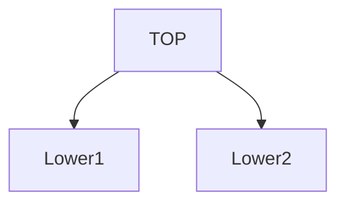
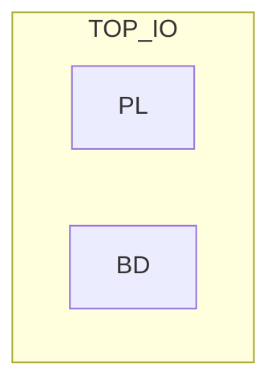

# scratch / test

```mermaid
  graph TD;
      A-->B;
      A-->C;
      B-->D;
      C-->D;
```

```mermaid
  graph TD;
      TOP-->Lower1;
      TOP-->Lower2;
```

```mermaid
flowchart TD
    subgraph TOP_IO
        PL
        BD
    end
```
